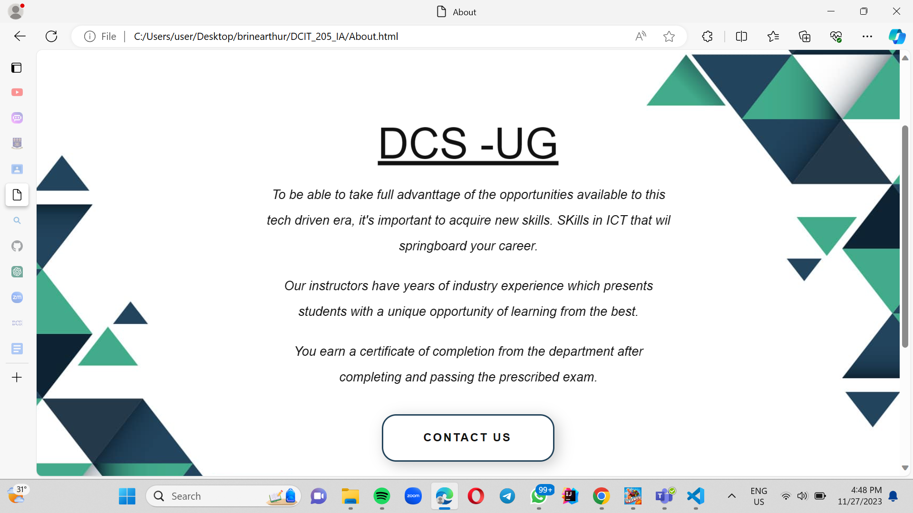
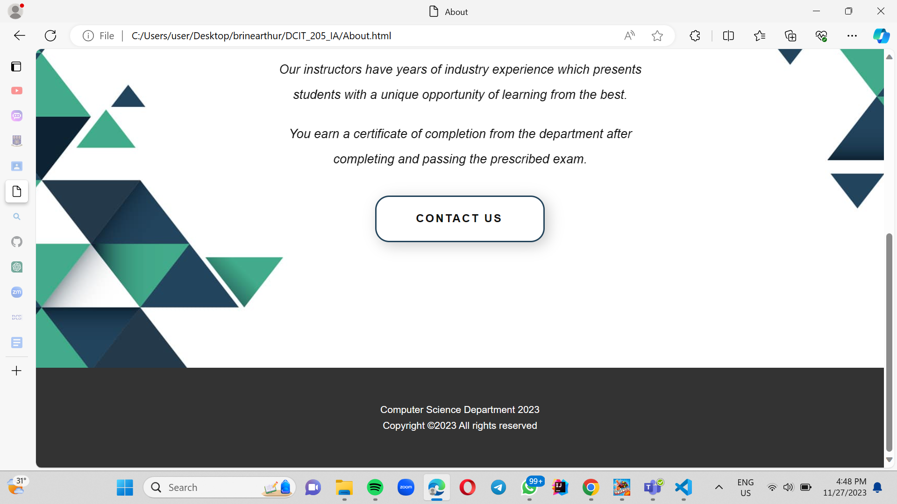
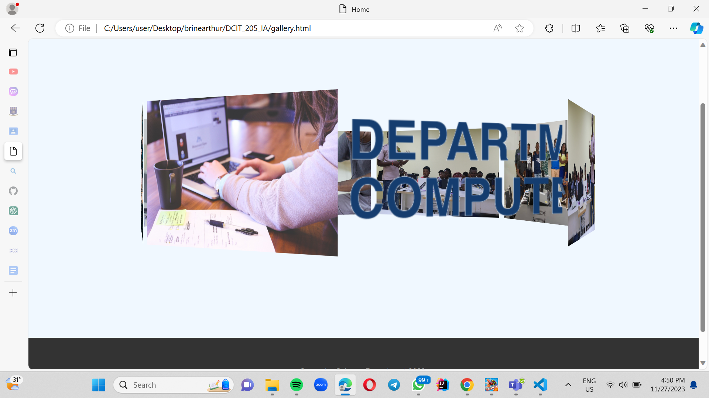

# Project Name

Brief Introduction:
-------------------
Welcome to DCS website! This website enhances communication, fosters transparency, and serves as a valuable resource for current and prospective students, faculty, staff, and the broader community This Readme document provides essential information for setting up and understanding the project.

## Table of Contents
1. [Introduction](#brief-introduction)
2. [Setup Instructions](#setup-instructions)
3. [Author](#author)
4. [Screenshots](#screenshots)
5. [Learnings](#what-i-have-learned)

## Setup Instructions
---------------------
### Cloning the Project
1. Clone the repository to your local machine:
    
    git clone https://github.com/Nana-Kay11/DCIT_205_IA.git
    

2. Change into the project directory:
    
    cd DCIT_205_IA
    

### Setting Up the Project
1. Visited Github and logged into my account
2. Navigated to the Github repository I wanted to fork
3. Clicked the fork button in the top right corner of the repository page
4. Chose where I wanted to fork the repository

## Author
---------
Your Name: Keziah Nana Arthur
Student ID: 11091047

## Screenshots
--------------

### Home Page

### About Page

### Gallery Page

## Short Courses Page

## Portal Page

## Research Page

## Faq Page

## Distance Page

## Programs Page

## What I Have Learned
----------------------
By creating a website, you can gain proficiency in these foundational languages that define the structure and presentation of web pages.Lerant CSS selectors to target HTML elements and applied styles. How to style and format HTML elemnts using CSS.. With the proliferation of mobile devices, responsive design has become crucial. Building a website provides an opportunity to learn how to create designs that adapt and display properly on different screen sizes and devices.